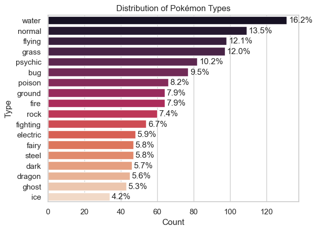
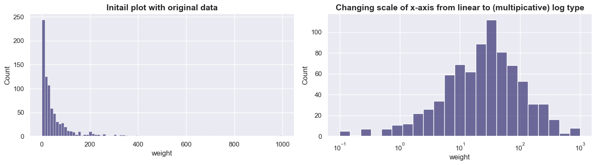
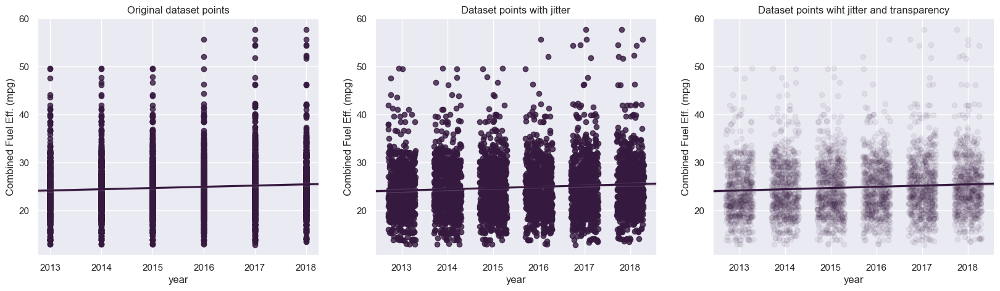
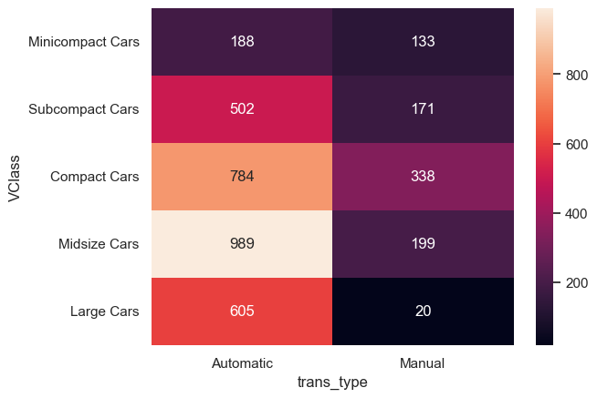
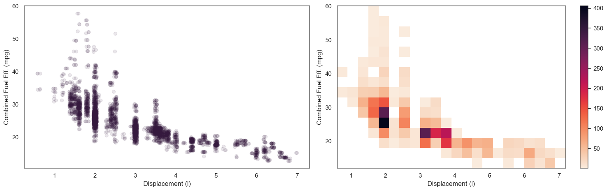
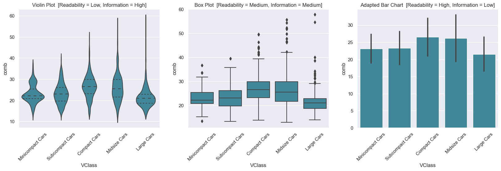
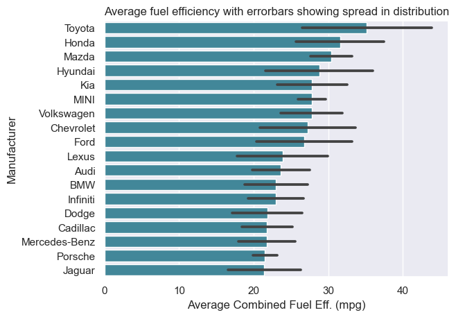
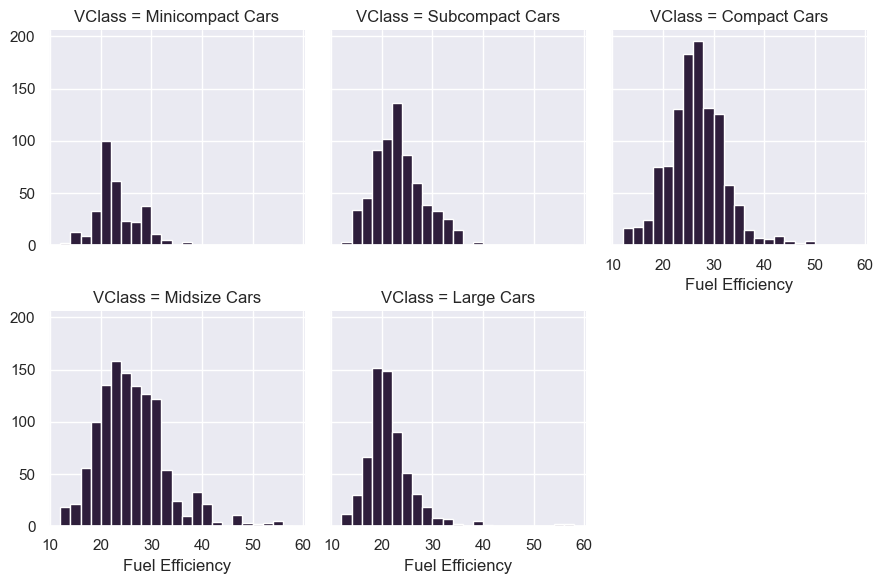
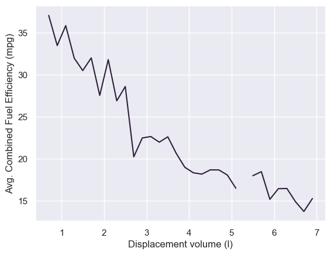
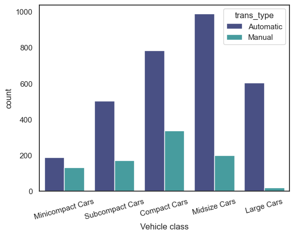

# Data Visualization

A single notebook explaining all the important data visualization techniques.

## Plots Covered

### Univariate Plots:

1. Count Plot (Qualitative)
2. Pie Chart (Qualitative)
3. Histogram (Quantitative)
4. Discrete Plot (Quantitative)

### Bivariate Plots:

#### For Quantitative vs Quantitative variable:
1. Scatter Plot
2. Heat Map 

#### For Quantitative vs Qualitative variable:
1. Violin Plot
2. Box Plot
3. Faceting
4. Adapted Bar Chart
5. Swarm Plot

#### For Qualitative vs Qualitative variable:
1. Heat Map
2. Clustered Bar Chart
3. Line Plot OR Adapted Histogram

## Plots Preview

### Count Plot:

### Histogram:

### Scatter Plot:

### Heat Map:

### Scatter vs Heat Map:

### Violin plot, Box plot and Adapted Bar Chart:

### Adapted Bar Chart:

### Facet:

### Line Plot:

### Clustered Bar Chart:

## Getting Started

1. Clone or download the repository.
2. Open `Visualization.ipynb` in Jupyter Notebook or Jupyter Lab.
3. Ensure you have the required libraries installed.
4. Follow the code examples for each plot, including concepts of feature scaling, handling outliers, data wrangling, and comparison.

## Contributions

Contributions are welcome - open issues or pull requests.
